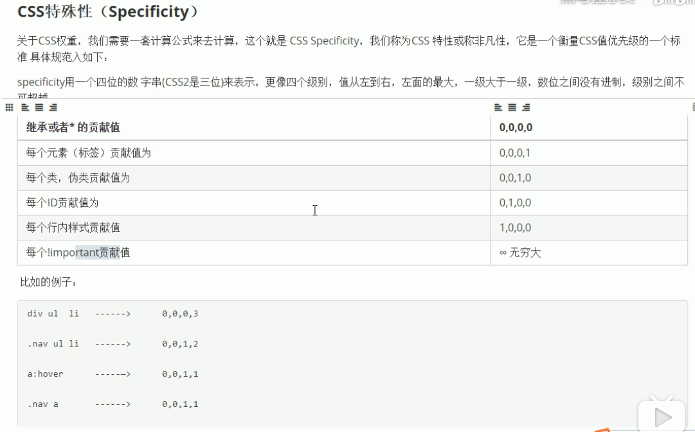

- 伪类选择器
```html
    a:link{
    	//未访问的链接
    }
    a:visted{
    	//已经访问过的链接
    }
    a:hover{
    	//鼠标放上去
    }
    a:active{
    	//选中状态
    }
```
- 主要识别点
> even是偶数，odd基数（nth-child(even)）

```html
1.text-align 水平居中 center/left/right
2.line-height 行高(比字体大8个像素）
3.首行缩进 text-indent 2em
4.字间距 letter-spacing  2px
5.单词间距 word-spacing 
6.半透明效果 rgb(a,b,c,d) d是取值范围0-1
7.文字阴影 text-shadow (a,b,c,d)ab是必须要写的（水平，上下时），后面两个参数可以省略
```
> div是块级元素，
> 行内元素（a,span,)给出宽高无意义，不会显示
> 行内块元素  宽和高可以修改(img,input,td)
- 模式转换
```text
  - 块级元素转换为行内元素：dispaly：inline
  - 行内元素转换为块级元素 ：display：block
  - 行内元素转换为行内块元素 ：dispaly：inline-block
```
- 交集选择器
```text
 - 标签.class类选择器 只会选择标签名对的且类名是给出的。
 - 并集选择器：div,p,sapan，.class类名，#id名采用逗号连接集体声明
 - 后代选择器：父级选择器/标签  子集的选择器/标签
 - 子元素选择器 ：使用> 只会选择亲儿子(这个可以一层一层的嵌套，儿子的儿子的儿子)
 - 属性选择器：[]内写属性（type，titile,等属性）
   - 带有title属性的a标签:a[]{}；
   - 带有title属性的a标签:a[属性=值]{}；
   -  [属性^=值]  选择与值相等开头的标签；
   -  [属性$= 值]选择以值结尾的标签；
   - [*=值]只要包含值得标签都选择
```
- 伪元素选择器
  - div::before{content:内容 }放在所选择的标签内部的前面
  - div::after{content:内容}放在所选择的标签内部的后面
### 背景图
- (可以控制平铺，位于div中的位置)多背景时，将颜色加载左后一个图上
- 网页中的坐标轴（以左上角为坐标原点,向右为正，向下为正）
   - background-postion：10px，10px; 第一个是水平的位置
   - background-postion：top,center;
   - background-postion：center,10px;混搭
   - backgrond-size:背景图片的大小：一般只改一个值，等比缩放
   - background:rgba();设置透明的背景
   - backgrond-size：cover（会自动进行等比缩放，图片可能少一点，溢出部分隐藏）
   - backgrond-size：contain（只要有一部分达到div，就不会进行缩放，盒子会剩余一部分，图片会完整显示），
- 将a标签设置相应的高度，宽度，在一行展示，需要将display：inline-block.
   在一行文本中，设定行高等于盒子的高度，就可以达到，文字垂直居中
- 文本的装饰 text-decoration ： none，underline，overline ，line-through

```html
a{
    height:50px;
    width:100px;
    display:inline-block;
    text-align:center; //水平居中
    line-height：50px;// 垂直居中
    background-color：red// 盒子的背景色
    color：文字的颜色
    font-size： 文字的大小
}1
```
---
### 权重问题(优先级)
```text
权重叠加（标签/类。标签。标签，权重相加）数值之间没有进制，0，0,0,10
继承的权重为0；使用自己的属性，只要自己有就使用自己的
```



````````````

###  盒子模型
- 盒子的边框设置
```css
border-color：red，      /*颜色*/
border-style：solid，dashed，dotted， /*边框样式*/
border-width：1px，/*边框粗细*/
border-top-size/color/style /*某个边框*/ 
```
- 表格相关信息
```html
<style>
    table{
    border-collapse: collapse; /* 合并相邻的边框*/
    }
</style>

<table cellpadding="0" cellpadding="0">
   <tr>
        <td></td>
   </tr>
</table>
```
- 圆角矩形
    - border-radius:10px；四个角相同，取宽高的一半50%就是圆形
    - border-radius:10px 40px； 左上角，右下角10px, 右上左下40px
    - 高度减半， border-radius：100px;成为一个椭圆
-　padding　内边距；内容距离边框的距离
    padding-left/right/bottom/top
    padding:两个值：上下，左右
    padding：三个值：上，左右，下
    padding：四个值：上右下左，顺时针
- margin 外边距，必须是块元素
    margin:30px auto 左右居中
- 插入图片(产品展示)
```html
    width:200px;
    height:50px; //修改图片大小
    margin-left：修改图片位置 ，因为图片也是一个盒子

```   
- 背景图片 (适合做一些背景图片，小图标)
  background-size：200px 600px;　//更该图片的大小
  background-postion:30px //图片位置