#  vue学习
### 一 基本语法
- 属性值动态绑定 简写 :href="" :src="",用到for循环里面的属性时不加{{}}
 - 1. v-bind 属性值绑定</img> 属性值动态绑定
 - 2. <a v-bind:href="属性值"></a>
 - 3. 绑定classs属性：
   - 1) 对象语法：v-bind:class/:class ="{class值:布尔值，class值:布尔值}" 如果本身也有其他class ，则会合并所有的class属性
   - 2) 也可以绑定 :class="getClass()"
        ​       methods:{
                   getClass:function(){
                       return {class值：this.布尔变量}
                   }
               }
   - 3) 数组语法：用的较少
- 4. 绑定style
           1) :style={属性名：属性值}如果属性值是直接写的，不是动态的则就直接用单引号括起来  属性可以不加，但是属性值要加引号，但是如果动态绑定，在data里面也要加引号， 多个属性值用,分开
```
- 方法绑定 v:on:click="方法名" @click="" click事件名()
    -  注意 ：如果方法后没有参数，引用时可以不加(),
    -  如果定义函数时加了参数，但是调用时没加括号，系统会传入event
    -  如果调用时加了括号，没传参，为默认参数为undefined
    -  若想传入自己的参数，和默认的event,event参数用$event 传入
    -  如果传入的参数是数字的话，直接写，如果传入的是字符串必须加引号，若果不加引号就会被当成变量
    -  阻止事件冒泡：在内层的事件上添加@click.stop
    -  阻止默认事件：@click.prevent 比如说:提交按钮
    -  监听按键点击 @keyup.enter/键盘符="事件名" enter抬起会触发事件
    -  只希望点击一次：.once
- 过滤器：filters:{过滤器名(参数){方法体}}，调用（参数|过滤器）
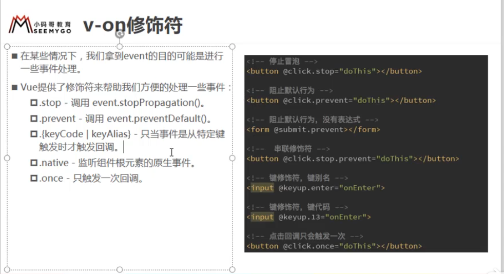
- v-once 属性值固定，展示后不能够更改<h2 v-once>{{插值}}</h2>
- v-html 将服务器返回来的html格式的文本，展示成html页面 标签 v-html="{{}}"
- v-text 将文本展示<h2 v-text={{}>你好啊</h2> 覆盖你好啊
- v-pre <h2 v-pre>{{你好啊}}</h2> 不解析{{}} ，直接展示成{{你好啊 }}
- 插值表达式可以调用方法{{方法()}}
- v-if 条件判断 <标签 v-if="变量(布尔值)"><标签 v-else-if="布尔表达式"><标签 v-else> 
   - 多数情况下不适用，多用computed{}
- dom复用 ，给dom加上自己唯一的key，就不会出现复用
- v-show 只是隐藏，不会删除 
- v-for="(单个item，index) in 数组", 遍历对象v-for="item  in 对象"这样获取的都是value
    遍历对象v-for="(value,key,index) in 对象"
    注意：v-for，最好加上:key属性，提升效率
- computed(计算)这个值只计算一次，有缓存，性能较好
    { fllname(就是一个属性名) :function(){return "123"} } fullname就是 属性名，取出来用直接就写{{fullname}}
- v-model 表单绑定
    - v-model.lazy实现点击回车时，失去焦点时才进行变量更新
    - v-model.numbber实现只能输入数字
    - v-model.trim 实现消除空格
​```html
<!--双向绑定，输入框的值 v-model="变量名"，不需要加插值{{}}-->
<input type="text" :value="message" @input="valueChange">
<!--注意$event ,可以取出值-->
<input type="text" :value="message" @input="message=$event.target.value">
<script>
//  - input也有自己的事件 @input="绑定方法"
valueChange(event){
    this.message =event.target.value;
}
</script>
```
 - radio 与v-model的使用 ，name属性是传到后台的key
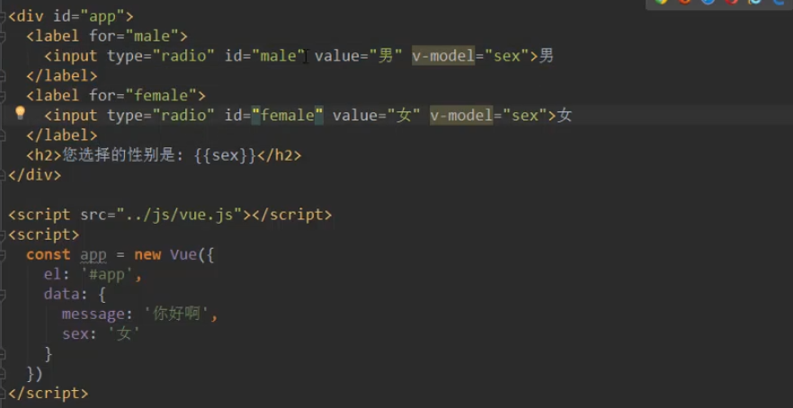
 - checkbox单选框 与v-model的使用
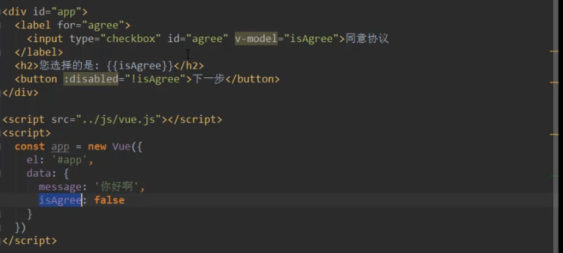
 - checkbox多选框 与v-model的使用
 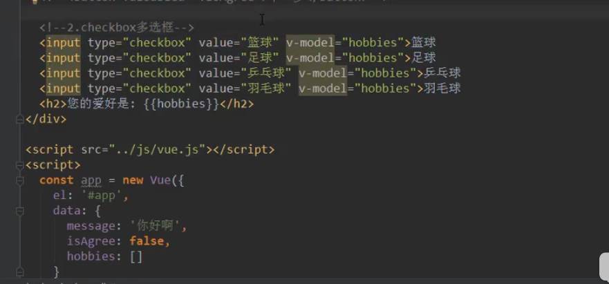
 - select单选 与v-model的使用
 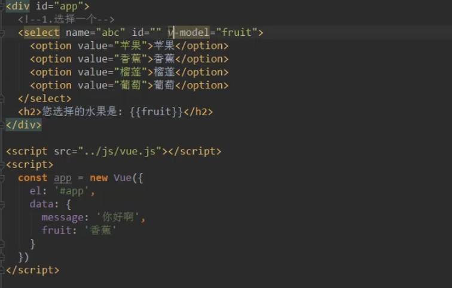
  - select多选 与v-model的使用
 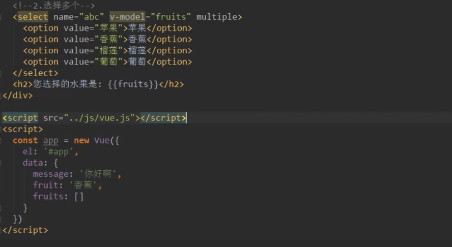
 - 值绑定
    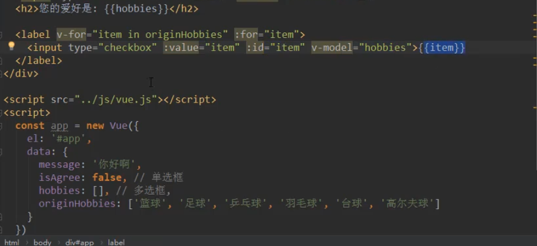
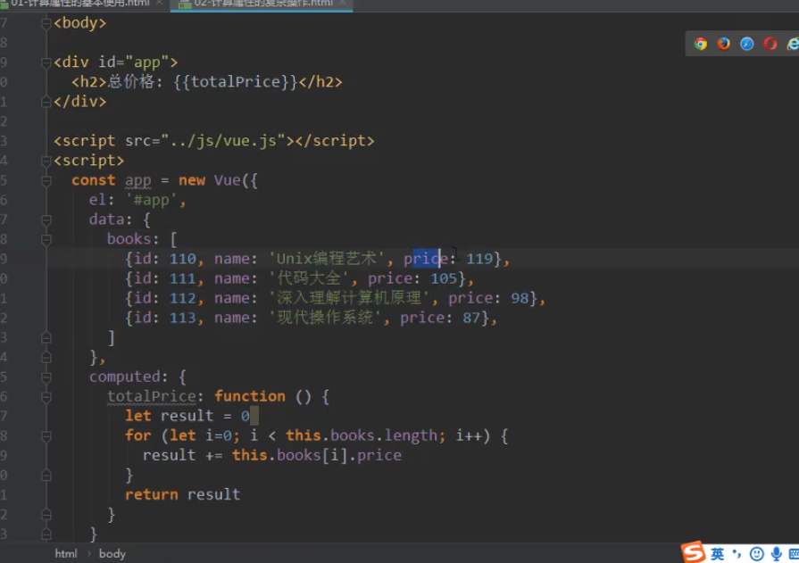
### 二 ES6语法
* const 定义变量必须进行初始化，const指向的对象不能改变，但是内部的属性可以改变
* 对象的增强写法 const obj ={name："lucy"},若果上面有一些变量
    直接写成 const obj ={name，age}，其中name，age 为变量
* 函数增强 直接写方法名(e){};
* 数组.splice(位置，删除长度，待添加元素) 带数组删除或添加，替换元素
* 数组末尾追加元素 数组.push(元素) 元素可以为多个
                  * 删除最后一个元素 pop（元素）
* 删除第一个元素：shift（元素）
* 在数组开始加元素 ：unshift(元素) 元素可以为多个
* 可变参数个数 fun add(...nums){} 调用 add(1,2,2,3,4)
* 数组反转 reverse
* 数组排序 
* 将数组内的元素转成用某个字符连接的字符串 数组.join('字符’)
*  数组遍历：
```javascript
for(let i =0;i<数组的长度;i++){
     
}
for(let i in 数组){
    数组[i]为单个项目
}
for(let item of 数组){
    这里的item就是一个项目
}
```
* 直接更改数组的元素值，vue不会直接修改，更新dom，要采用其他方法 splice
* vue.set(数组，索引 ，修改后的值)
* 数字.toFixed(保留的位数)
* 数组filter函数  取出大于100的数到新的数组
```javascript 1.8
const nums=[10,20,30,40,5555,666]
// 接收的是一个新的数组, 回调函数
let newNums =nums.filter(function (t) { 
    return t>100; //必须返回布尔值，
 })
 
```
* 数组map函数 
```javascript 1.8
const nums=[10,20,30,40,5555,666]
let newNums =nums.map(function (t) { 
    return t*2;
 })

```
* 数组reduce函数,对数组内的每个元素进行汇总，递归相加
```javascript 1.8
const nums=[10,20,30,40,5555,666]
let  total =nums.reduce(function (p1, p2) {  //p1为上一个值，p2可以是一个对象
    return p1+p2;
 },0)//这里的0就是total的初值，下次循环将初值赋给p1，循环相加
```
```javascript 1.8
// 大于100的数乘2后相加的和
const nums=[10,20,30,40,5555,666]
nums.filter(function (t) { 
    return t>100;
 }).map(function (t) { 
     return t*2;
  }).reduce(function (p1, p2) { 
      p1+p2;
   },0)
```
* 箭头函数
```javascript 1.8
const obj=function() {
  
}
const ccc =(没有参数的情况)=> {
   // 没有返回值 
}
const ddd =(num1,num2)=>{
    return num1+num2;
}
const  fff =(num)=>{
     return num*num;
 }
 // 括号可以省略
 const  fff =num=>{
     return num*num;
 }
 // 返回值问题
 const test =()=>{
    // 代码块
 }
 // 只有一行代码,有返回值
 const ddd =(num1,num2)=>num1+num2;
  // 只有一行代码,有返回值 //console.log返回值为undefined
  const demo =()=>console.log("123")   
 只有一个函数，只有一行代码
 const  aaa = h=>h+h;
```
* 箭头函数 中的this的使用(引用最近最近作用域中的this) 内层外层都是箭头函数时obj，其余都是Windows
    - 向外层作用域中一层层找，直到有this
```javascript 1.8
const obj={
    aaa(){
        setTimeout(function() { 这个函数刚开始会把windows作为对象传进函数，所以this 为windows
            console.log(this) //这种格式的都是Windows
        })
        this
        setTimeout(()=>{ //这个函数本身是没有this的会自动向外罩一层，
            consloe.log(this)   //是aaa这个函数{}，该函数是在对象里定义的所以这个this为obj
        })
    }
    
}
```
### 三 监听
watch {
    监听的属性（data内的值）
    这里就是监听data内的name的值，这时候就不需要父子组件传值，双向改变，直接在子组件内监听，然后传值给父组件
    name(newValue,oldValue){
      
    }
### 四 组件
#### 1. 父子组件
- 在A里面注册B，将A注册在vue实例里 A就是父组件，B为子组件
- 在子组件内data不能是对象；必须是函数,这样多次调用不会产生影响，是在堆开辟内存，每次调用都是不同的内存地址
     data(){
      return{
          title:"123",
      }
     }
#### 2. 父子组件通信
##### 1.父组件向子组件传值（变量名是驼峰是，使用-）
   - (1)在子组件定义一个props:['变量名’，'变量名2’]
      (2)props:{变量名:数据类型} String ,Number,Boolean,Array,Object,Date,Function,Symbol
      (3)props:{变量名:{type:变量类型,default:默认值，required:true}}，当父组件没传时，就用子组件.如果default是一个数组则需要
         写成函数的样子default(){return[]/{}}
      (4)props:{validator:function(){自定义验证}}
   -  (2)在调用方也就是父组件通过v-bind:变量名="父组件内传递的变量值”,父组件传值时，变量名使用驼峰时用-代替
   -  (3)子组件传值时就直接使用变量名
   -  (4) 若父组件传递的就是普通的固定的值，并不是从自己内部的data取出，直接固定 子组件接收变量名="需要传递的数据"
##### 2.子组件向父组件传值
        在子组件内 this.$emit(事件的名字，参数)
        在父组件内监听事件 v-on:事件的名字="父组件自己的的方法(这里可以不带参数)"，父组件会默认把参数带过去
        父组件自己的方法例子：demo(子传递过来的参数，是一个形参){}
##### 3.通过子组件改父组件的值(输入框的值都是字符串，可以调用方法转换类型parseInt（值）)---监听也可以做到
      1.在父组件定义props及要向子组件传递的值，
      2.子组件先在data里定义一个自己的变量接收props，将自己的data里的值进行展示，并且给
         其绑定一个方法，比如@input的方法，在值发生时，调用该函数，将data内的值改为event.target.value.此外再执行一个$emit的方法，该方法的
         参数为：(父组件监听的事件名,需要传递的参数);
      3. 父组件调用子组件的地方，传递需要向子组件传递的数据，在写一个监听的函数，@监听的事件名="父组件需要做的事情，就是将data里的值修改"
  #####  父子组件访问方式
      1.父访问子：this.$children 子组件是一个数组 ，拿取子组件的东西，可以打印看一下，因为子组件在数组中的位置不确定，少用
      2.父访问子：this.$refs 需要在子组件 加一个ref="自己的id",（this.$refs.组件的id.子组件的方法或者属性），尽量自己打印一下
      3.子访问父：在子组件内this.$parent.父组件的相关属性或者方法
      4.访问Vue实例 this.$root
### 插槽slot
  - 在需要变更的地方用标签<slot>默认的内容</slot>，调用的时候用自定义需要的标签代替插槽内容就好，直接写不用加<slot> 
  - 如果替换的内容很多的话，都会换进去
  - 如果子组件有很多插槽的话，需要给插槽起名字 <slot name ="自己的名字"></slot>
    替换时需要这样写<button slot="插槽的名字"></buttton>
##### 变量作用域   
    - 在引用子组件时，使用的是父组件的变量值，把子组件当成一个div，其内部的属性由父组件决定
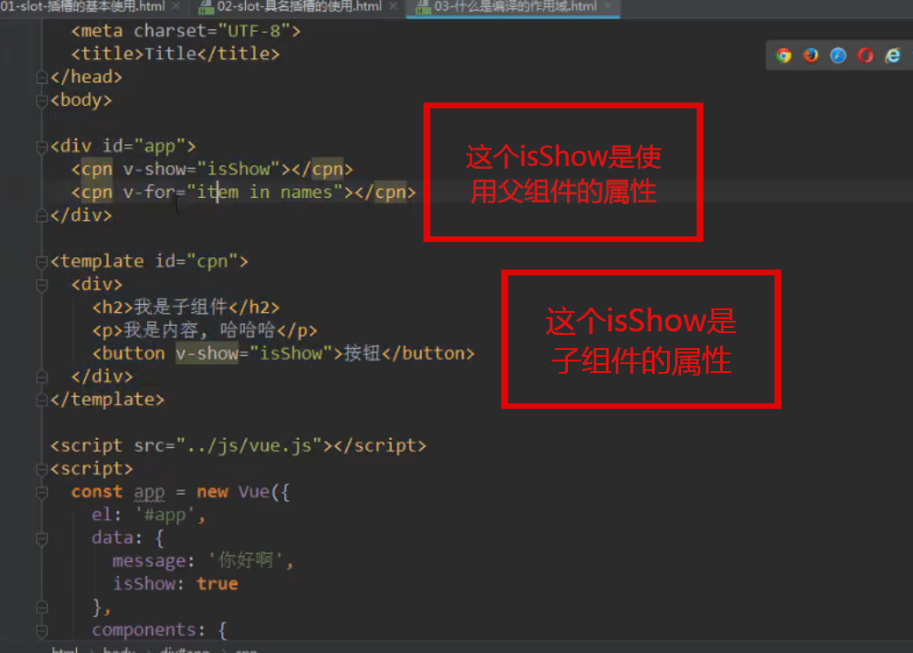   
##### 插槽带数据，在父组件定制化显示，插槽中绑定数据，父组件可按自己的需求展示出不同的样式
##### 父组件替换插槽的标签，但是内容数据由子组件来提供
      子组件内：<slot :data（名字不唯一，后面取出来用时要对应起来）="子组件内部的数据">默认的展示样式></slot>
      父组件：
      <模板名>
        <template slot-scop="起个名字( 如slot这个名字具备插槽的一切)">
                父组件定制化显示，例如：
                <span v-for="item in 名字（slot）.data> {{item}}</span>
        </template>
      </模板名>
### 模块化开发
#### 1 ES6的导入导出
```text
let  name ="lucy";
let age =18
function sum(){
}
export{
    // 需要导出的方法，属性
    name,age,sum
}
export let age =20 //这是第二种导出的方法
export function 函数名(){
}
export class Person{
    //导出类
    run(){
    }
}
------------------------------------
const adress ="背景"
export default adress；//一个js文件只能有一个default导出
import aaa(名字随便起，相当于 adress) from ''
--------------------------------------

1. import {需要引入的方法，属性，类}  from '.js'
   使用类：const lucy =new Person();
    lucy.run()
2. import * as 变量名 from ''
   取出来用，变量名.需要的方法，属性
```
####  commonJs的引入导出
- model.export={变量，函数}
- const {变量，函数} =require(js)


### webpack学习
- 1.进入到需要编译的项目吗，输入命令：webpack  位置/主js  另外一个位置/新的名字.js 
- 2.新建文件webpack.config.js 通过commonJs写语法
```text
const path =require('path') //node里的PATH js文件
model.exports{
    entry:'',
    output:{
        path:'路径'，动态获取绝对路径 path.resolve(__dirname,'dist')
        filename：‘打包后的文件名’
        publicPath:'dist/' //这个时候index.html,不在dist目录下，如果index.html，也在distM目录下，则删除这个配置
    }
}
这时候就可以直接写一个单词，webpack执行打包，在终端敲击命令使用的是全局的，如果是npm run 命令 就是使用本地的在package.json内配置的script
```
- 3. 处理css文件 引入对应的loader (百度搜索)，配置model
   - css loader 只负责加载，再引入style-loader（将样式加载到DOM),注意执行顺序，从右往左。style loader 在左
- 4. 处理less文件，,定义，使用，百度
```less
@fontSize:50px;
@fontColor:orange;
body{
  font-size: @fontSize;
  color: @fontColor;
}
```
- 5. 处理图片，加载loader，文件url_loader
    option 可以对图片大小进行限制，如果图片大小小于限制，以BASE64编码,
    图片大小大于限制，需要加载一个file-loader，除此之外，还需要在webpack.config.js加一个publicPath:'打包的地址dist/'
```javascript 1.8
module.exports = {
  module: {
    rules: [
      {
        test: /\.(png|jpg|gif)$/,
        use: [
          {
            loader: 'url-loader',
            options: {
              limit: 8192,
              name:'img/[name].[hash:8].[ext]'// 用原来的图片命名加上8位的hash码，[内为变量]
            }
          }
        ]
      }
    ]
  }
}
```
- 6.babel文件配置
```text
npm install --save-dev babel-loader@7 babel-core babel-preset-es2015
```
```javascript 1.8
module: {
  rules: [
    {
      test: /\.js$/,
      exclude: /(node_modules|bower_components)/,
      use: {
        loader: 'babel-loader',
        options: {
          presets: ['es2015'] //老师的写法
        }
      }
    }
  ]
}
```
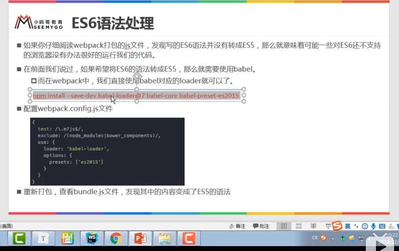 
###  webpack配置vue
- 安装vue npm install vue --save 这个是运行时依赖，所以去掉-dev
- import Vue from 'vue'
- new Vue({
    el:'#app'
    data:{
    
    }
})
```text
**如果出现 runtime-only错误**
配置一个 ，与model 同级
resolve：{
    extension:['.css','.vue'] //省略扩张名
    alias:{
        'vue$':'vue/dist/vue.esm.js'
    }
}
}
```
- 1.安装vue-loader ,vue-template-compiler
> npm install vue-loader  vue-template-compiler --save-dev
```javascript 1.8
module: {
  rules: [
    {
      test: /\.vue$/,
      use:['vue-loader'] 
      //vue-loader 14以后还需要配置插件，可以使用版本低一点，直接^13.0.0 会安装13开头的版本，重新，npm install
    }
  ]
}
```
- 2.配置版权信息，处理index.html,这个会自动导入script
    - 处理index.html 安装插件  npm install html-webpack-plugin --save-dev
    - 在webpack.config.js 头部导入插件const HtmlWebpackPlugin =require('html-webpack-plugin')
    - plugins内部进行配置，而且需要删除，下面的配置
    - publicPath:'dist/' //这个时候index.html,不在dist目录下，如果index.html，也在distM目录下，则删除这个配置

```text
配置一个 ，与model 同级
plugins：[
    new webpack.BannerPlugin('文字');
    new HtmlWebpackPlugin({
        template:'index.html' //这个index.html 要与webpack.config.js同级目录
    })
]
我们所创建的index.html只需要将入<div id="app"></div>不需要手动引入script
```

- 3.将js代码整理
    - 安装插件 npm install uglifyjs-webpack-plugin@1.1.1 --save-dev
    - 引入插件 const UglifyjsWebpackPlugin =require('uglifyjs-webpack-plugin')
    - 在plugins内配置一下
```text
    配置一个 ，与model 同级
    plugins：[
        new webpack.BannerPlugin('文字'); //丑化后没作用
        new HtmlWebpackPlugin({
            template:'index.html' //这个index.html 要与webpack.config.js同级目录
        })
        new UglifyjsWebpackPlugin()
    ]
    我们所创建的index.html只需要将入<div id="app"></div>不需要手动引入script
 ```
- 4.热加载
  - 安装插件 npm install webpack-dev-server@2.9.3 --save-dev 对应webpack版本3.6
  - 配置
  - 这个时候运行的命令就会发生更改，需要在package.json script 配置新的指令
  - "dev":webpack-dev-server --open自动打开网页 --inline 实时刷新 --color 有颜色，--progress 打包百分比进程
```text
与model同级目录
devServer：{
    contentBase:'./dist' 服务的文件夹
    inline：true 实时监听
    port:端口  
}
```
- 5. webpack配置文件分离 
    - 在开发模式：安装插件 webpack-merge --save-dev
    - 引入 const webpackMerge =require('webpack-merge')
    - 引入 base.config.js const baseConfig =require('./base.config')
```text
           module.exports = webpackMerge(baseConfig,{
                devServer:{
                    contentBase:'./dist' 服务的文件夹
                     inline：true 实时监听
                     port:端口  
                   也就是开发模式自己的一些配置
                }
            })
```
    - 在package.json 脚本中指定配置文件
        "build":"webpack --config ./build/prod.config.js"
        "dev":"webpack-dev-server --open --config ./build/dev.config.js"
    - 修改输出路径
```text
model.exports{
    entry:'',
    output:{
        path:'路径'，动态获取绝对路径 path.resolve(__dirname,'../dist')
        filename：‘打包后的文件名’
        publicPath:'dist/' //这个时候index.html,不在dist目录下，如果index.html，也在distM目录下，则删除这个配置
    }
}
```
### node
- npm init 项目初始化 会建立一个package.json
- 项目自己内部导入webpack  npm install webpack@3.6.0 --save-dev
- 开发时依赖 --save-dev ,开发时依赖
- 运行时依赖
### vue脚手架 （vue init webpack 项目名）(vue create 项目名)
- 项目名字：ProjectName :enter
- 项目描述： Project description ：enter
- 作者：读取的是git的作者
- 选择模式：暂时选择一
- 选择路由：
- 是否启动js检查：Use ESLint to lint your code? n
- 如果启动了检查：选择采取哪一个规范：标准，爱彼迎，
- 设置单元测试：n
- 设置端到端测试，用nightWatch(selenium),自动执行浏览器，暂时不懂
- 使用何种方式，npm 或者yarn
- static 文件夹下的所有东西会原封不动的复制发dist下，如果静态资源放在src下，会根据文件大小决定
- .babelc  "browsers": ["> 1%", "last 2 versions", "not ie <= 8"] 市场份额大于1%
- .postcssrc.js 控制css
#### runtimeOnly 与runtimecomplier的却别
- runtimecomplier template -ast（语法树）-render-virtual dom -ui
                - runtimeOnly  render-virtual dom -ui
                - runtimeOnly render:function(creatElement){return createlement(App)}
                - createElement('标签','标签的属性','标签内的要展示的数据’ )
    return createElement('h2','class:box',['你好啊',createElement('button'['按钮'])])
####  cli3创建项目与相关配置 
1.启动vue ui 在页面中进行配置
2.在@vue中 webpack.config.js中进行 ，找到lib/service.js
3.若想相关配置，自己创建一个vue.config.js
### vue路由 脚手架会默认配置好
- 安装路由：npm  install vue-router --save 运行时依赖
- 在src目录下创建router/index.js
- import Vue from 'vue' 引入vue
  import Router from 'vue-router' 引入 vue-router
  Vue.use(Router)  给vue安装插件  Vue.use(插件)
  在main.js 中导入，写的文件夹，默认导入index.js ,在router/index.js中导出相关信息
  const routers =[
    {   
        path:'/'  重定向到主页，并在地址栏中显示home
        redirect:'/home'
    }，{
    path：‘’，
    componnent：直接写上面引入的组件名
    }
  ]
  const router =new Router({
    routers,
    mode:'history'  将hash模式改为history模式，这样就没有#号了
  })
  export default router
```vue
import Vue from 'vue'
import Router from 'vue-router'
import home from '../components/home'
import about from '../components/about'
Vue.use(Router)

export default new Router({
  mode:'history',
  routes: [
    {
      path: '/',
      redirect:'/home'
    },
    {
      path: '/home',
      component: home
    },
    {
      path: '/about',
      component: about
    }
  ]
})
```
-  <router-link  to="/home">home</router-link>
    to 用来指定跳转路径
    tag 指定router-link 渲染为什么组件 ,就会被渲染成button<router-link tag=’button'  to="/home">home</router-link>
    replace 不会留下history记录，指定replace,无法使用后退键
    active-class ,当router-link 匹配的路由成功，回给当前元素设置一个router-link-active的class，设置active-class可修改默认的class名称
    若要全局修改，则在mode 那个地方，也就是router的那个js中加入 linkactiveClass
    <router-view></router-view>
- 通过代码控制跳转，vue 给每个组件都添加了一个data属性$router,直接用this.$rouer取出来用
   给对应的元素添加相关的触发方法，通过this.$router.push('/home'),this.$router.replace()
- 在地址栏添加相应的参数，带参跳转
   首先采用的是restful风格传参，在配置路由信息时 { path: '/about/:参数名', component: about}
   在<router-link  to="/home/传递的参数">home</router-link> 如果这个参数是从data内部取得，动态绑定
   <router-link  :to="'/home/'+userId">home</router-link>,这个userId是从data内部动态决定的
   取出地址栏中的相关参数信息，则在方法中获取this.$route.params.参数名，如果在插值表达式中省去this
   通过代码控制跳转，vue 给每个组件都添加了一个data属性$router,直接用this.$rouer取出来用
   给对应的元素添加相关的触发方法，通过this.$router.push('/home'+this.data内部的属性),this.$router.replace()
- 普通的传参模式
    路由信息不需要更改
    在设置跳转的link标签时 <router-link  :to="{path:'路径',query:{name:'变量'，age:'''}}">home</router-link>
    取出地址栏中的相关参数信息，则在方法中获取this.$route.query.参数名，如果在插值表达式中省去this
    通过代码控制跳转，vue 给每个组件都添加了一个data属性$router,直接用this.$rouer取出来用
    给对应的元素添加相关的触发方法，通过this.$router.push({path:'路径',query:{name:data内部的值
    }}),this.$router.replace()
### 路由懒加载，js文件打包
 - 如果不区分，会一次性加载全部的js,css代码，脚手架直接分开加载，区分为。1.用户的js，2.服务商/第三方的js，3.为了打包而进行的js转换的代码js
 - const home =()=>import('../components/home');
### 路由嵌套
 - 在之前配置的路由的地方嵌套一个children[path:'不带/',components:懒加载组件名]
 - 创建相应的子子组件，(谁用，谁留空间)在引用子组件的地方设置相应的链接，写上完整的路径名
    <router-link  to="/home/message">homeMessage</router-link>
  并且预留子组件的位置，留坑，<router-view>
### 路由导航守卫
> https://router.vuejs.org/zh/guide/advanced/navigation-guards.html#%E5%85%A8%E5%B1%80%E5%89%8D%E7%BD%AE%E5%AE%88%E5%8D%AB
   - 更改标题：在created：document.title="名字"
   - 使用全局守卫，在router/index.js内部写 router.beforeEach((to,from,next)=>{documnet.title=to.matched[0].title,next()})
   - 在路由信息内部配置mata属性{ path: '/',meta:{title:'名字'}},
   - 参考官方文档，可以在路由守卫中加入验证
       router.beforeEach((to,from,next)=>{
         console.log(to);
         document.title=to.matched[0].meta.title;
         next();  不要忘记调用next()方法
       })
   - router.afterEach((to,from,next)=>{  跳转后进行的操作
   
   })
   - 路由独享守卫
```vue
 path: '/foo',
      component: Foo,
      beforeEnter: (to, from, next) => {
        // ...
      }
```
- 组件内的守卫
```vue
const Foo = {
  template: `...`,
  beforeRouteEnter (to, from, next) {
    // 在渲染该组件的对应路由被 confirm 前调用
    // 不！能！获取组件实例 `this`
    // 因为当守卫执行前，组件实例还没被创建
  },
  beforeRouteUpdate (to, from, next) {
    // 在当前路由改变，但是该组件被复用时调用
    // 举例来说，对于一个带有动态参数的路径 /foo/:id，在 /foo/1 和 /foo/2 之间跳转的时候，
    // 由于会渲染同样的 Foo 组件，因此组件实例会被复用。而这个钩子就会在这个情况下被调用。
    // 可以访问组件实例 `this`
  },
  beforeRouteLeave (to, from, next) {
    // 导航离开该组件的对应路由时调用
    // 可以访问组件实例 `this`
  }
}
```
- 记录上次访问的位置
1.使用<keep-alive exclude="需要排除的组件的name,home,about"> 包裹住router-view,保持组件不被频繁的销毁创建，页面活跃状态activited:deactived函数
3. 如果没有这个，每次都会创建新的，每次离开都会销毁，在app.vue内部使用时使用，其他的所有组件都不会进行频繁的创建销毁
2. 在data内部设置一个属性path用来记录跳转前的路径，初始值给想要默认展示的链接，
3. 在actived函数内部使用this.$router.push(path)
4. 在beforeRouteLeave函数内部更新path的值 this.path=this.$router.path   
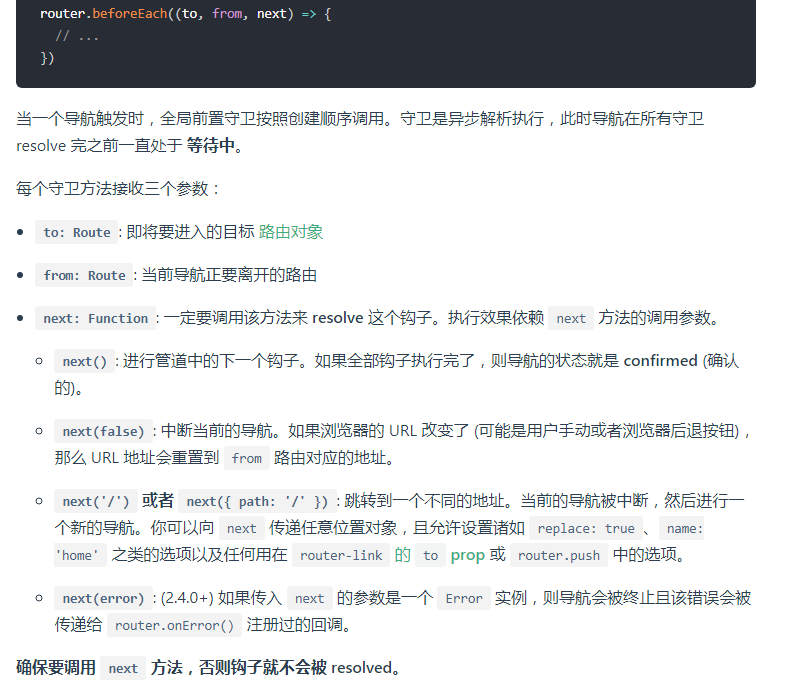   
### 项目经验
1.如果想给插槽设置一定的样式，给插槽包裹一层div，防止属性被替换掉
2.关于路径问题，脚手架2的方法在webpack.base.conf.js中设置别名，如果不是import方式引入需要在前面加~,设置components、views、assets
### css样式(引入css样式)
- 在<style></style>内部引用样式，@import "地址"，或者在main.js 中require(地址)
### 练习
- 点击数组中的元素，该元素变颜色，其中的active 为一个css样式
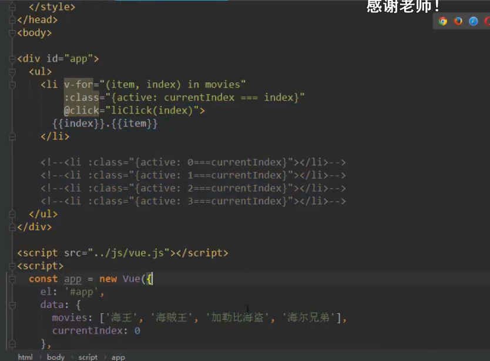 
