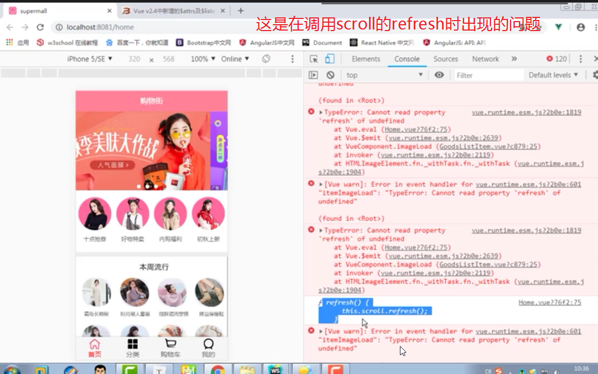
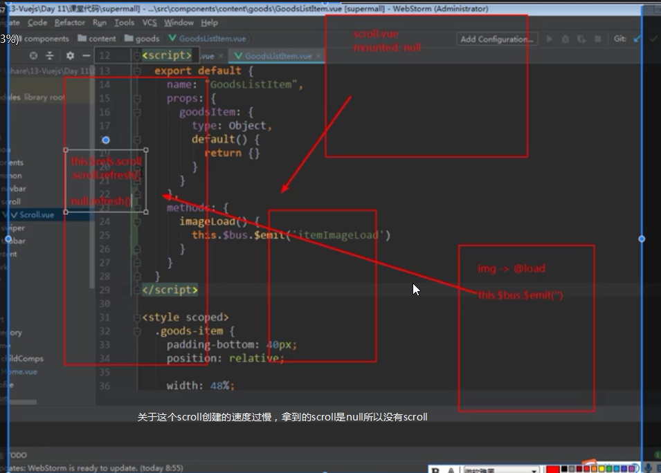

#           supermall学习与制作
### 一、项目步骤
- 1.使用脚手架创建项目，git项目管理
- 2.完善项目目录结构
- 3.引入css，个性化配置webpack，配置项目的路径别名，引入文件.editorconfig


### 注意的地方
- 1.在配置路径别名的时候不需要写resolve，这个与脚手架2有一定的区别，可以对别一下

- 2.快速构建一个列表显示"ul>{列表$}>li*100"

- 3.使用绝对定位，z-index显示在最上面，在给他其他的最外层组件一个padding-top=固定定位组件的高度

- 4.父子组件传递数组时候如果传递的是数组，也要加：看下面的例子

  ```text
  <tab-control :titles="['mary','lily']"> </tab-control> 
  这个tab-control是一个子组件，titles要求是一个数组，若不加： 传递的是一个字符串
  所以需要加：
  ```
 ### better-Scroll的使用
 - 在最外层写个wrapper,里面写一个元素，在这个元素内部可以添加更多的元素div是wrapper 里面写一个ul ul 里面有很多li
 - 这个warpper所管理的容器必须设置一定的高度，overflow:hidden是隐藏超出的内容
 - scroll 对象中有一个属性是记录可滚动的高度，scrollerHeight  
 - 刚开始在计算高度的时候没有把图片的高度算进去，所以刚开始记录的scrollerHeight是明显偏小
 - 后面图片加载完整，并没有更新scrollerHeight,所以滚动出现问题
 - 解决方法：
 ```text
img.onload=function(){
这是普通js
}
在vue 中直接在图片上加@load="specialied method",调用scroll的refresh()方法，刷新计算的新高度
```
* 有可能会出新refresh的bug


### bus事件总线，也可以使用vuex(非父子组件通信)
```text
在main.js中 vue的原型上加一个总线 Vue.prototype.$bus=new Vue()
一个发射事件 子组件.$bus.$emit('method')
一个监听 父组件.$bus.$on('method',res=>{})老师是在mounted中监听的，在created中有可能dom还没完全生成，找不到组件
```

  

  

